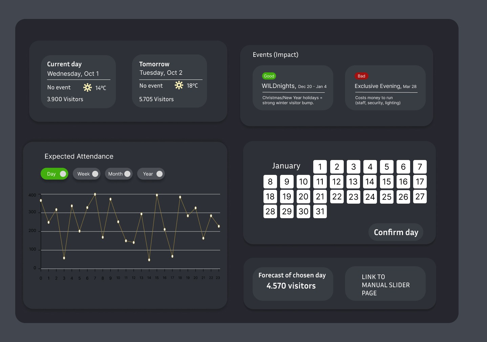

# Wildlands_Procyon

Procyon is a zoo traffic prediction system for Wildlands. Using machine learning on visitor data, weather data and event data to predict the amount of visitor the zoo will recieve on a specific day.

## Features

*  Interactive dashboard to be hosted online.
*  Constantly updating predictions
*  Sliders to manually change weights of events, rain etc.

