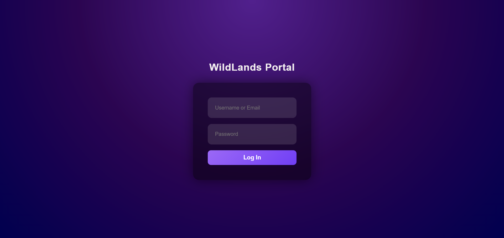
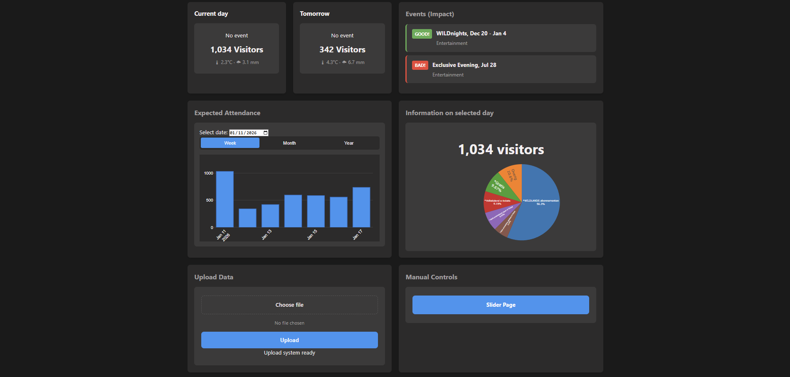
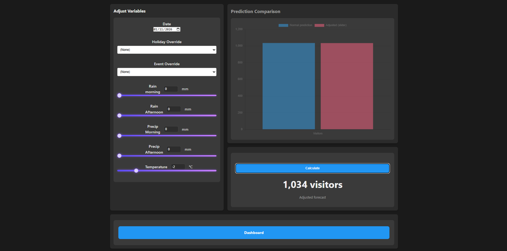

# Wildlands_Procyon

Procyon is a zoo traffic prediction system for Wildlands. Using machine learning on visitor data, weather data and event data to predict the amount of visitor the zoo will recieve on a specific day.

## How to use
This guide walks you through setting up and running the Wildlands Procyon visitor prediction dashboard locally.
Prerequisites:
*	Python 3.12+
*	Docker & Docker Compose (for containerized deployment)
*	Git

### Step 1: Prepare Your Data
The application requires specific input files to be placed in the data/raw/ directory. Ensure you have the following files:
*	campaigns 2022-2026.xlsx
*	recurring_events_drenthe.xlsx
*	Holidays 2022-2026 Netherlands and Germany.xlsx
*	WeatherData2022_2023.csv
*	visitors.csv
*	weather.xlsx
*	ticketfamilies.xlsx

### Step 2: Clone and Setup
In the terminal:

    git clone https://github.com/yourusername/Wildlands_Procyon.git

    cd Wildlands_Procyon

### Step 3: Run the Data Pipeline
Before starting the application, you need to clean and process the raw data.

    python -m scripts.run_data_cleaning

This script will:
*	Read raw data files from data/raw/
*	Process and clean the data
*	Output processed file “processed_merge.csv” to data/processed/

Expected output:
Starting zoo data cleaning pipeline...
Data cleaning completed!

### Step 4: Train the Models
Next, train the prediction models using the processed data.

    python -m scripts.run_model_training

This script will:
*	Load the processed data from data/processed/processed_merge.csv
*	Train both global and family-specific models
*	Save models to the configured data/models directory

Expected output:
Starting zoo model training pipeline...
Model training completed!

### Step 5: Generate Predictions
Generate 365-day predictions for the dashboard.

    python -m scripts.run_make_predictions

This script requires the following to be present:
*	ticketfamilies.xlsx
*	recurring_events_drenthe.xlsx
*	campaigns 2022-2026.xlsx
*	Holidays 2022-2026 Netherlands and Germany.xlsx
*	WeatherData2022_2023.csv
*	processed_merge.csv (from Step 3)
*	lgbm_model.pkl (from Step 4)
*	Family-specific models and feature columns

Expected output:
Starting 365-day zoo prediction pipeline...

365-day prediction completed!

The predictions will be saved to data/predictions/forecast_365days_"currentdate"_"currenttime".py

### Step 5.5: Environment Variables (Required)
The application uses Flask sessions for authentication.

Before running the web application, a SECRET_KEY must be set on the terminal.

#### Windows (PowerShell):

    setx SECRET_KEY "YOURSECRETKEYHERE"

#### Linux / macOS:

    export SECRET_KEY="YOURSECRETKEYHERE"

After setting the environment variable, restart your terminal or container.

### Step 6a: Run Locally (Development)
Install dependencies:

    pip install -r requirements.txt

Run the Flask application:

    python webapp/app.py

The application will be available at http://localhost:5000

Note: You'll need to log in. The application uses a SQLite database (database.db) that will be created automatically on first run.

### Step 6b: Run with Docker (Production)
Build and run the application using Docker Compose:

    docker-compose up --build

This will:
*	Build the Docker image using the provided Dockerfile
*	Start the container on port 5000
*	Mount necessary volumes for data and predictions

The application will be available at http://localhost:5000

To stop the container:

    docker-compose down

## Key Features
*	Dashboard: View visitor analytics and predictions
*	Slider Controls: Adjust parameters and make your own predictions
*	Data Upload: Upload additional CSV/XLSX files to data/upload/
*	Authentication: Login system with hashed passwords
*	REST API: Endpoints for accessing visitor data and predictions

## Project Structure
    Wildlands_Procyon/
    ├── .github/
    │    └── workflows/ 
    │	     └── ci.yaml 
    ├── .vscode/
    │    └── settings.json 
    ├── data/
    │   ├── database/  
    │   ├── models/  
    │   ├── predictions/           # Generated predictions
    │   ├── processed/             # Cleaned data
    │   ├── raw/                   # Input data files
    ├── scripts/
    │   ├── paths.py
    │   ├── run_data_cleaning.py
    │   ├── run_model_training.py
    │   └── run_make_prediction.py
    ├── src/
    │   ├── model_training/              # Model training modules
    │   │    └── model_training.py       
    │   ├── data_cleaning.py
    │   ├── day_of_week_calib.py
    │   ├── main.py
    │   ├── new_365days_predict.py        # Prediction pipeline
    │   └── paths.py
    ├── tests/                     # Unit and integration tests
    │   ├── error_test.py
    │   ├── synth_test.py
    │   └── test_data_cleaning.py
    ├── webapp/
    │   ├── static/                # CSS, JS, static assets
    │   │    ├── script.js 
    │   │    └── style.css  
    │   ├── templates/             # HTML templates
    │   │    ├── Dashboard.html 
    │   │    ├── Loginpage.html 
    │   │    └── Slider.html 
    │   ├── app.py                 # Main Flask application
    │   └──  database.db           # SQLite database
    ├── compose.yml                # Docker Compose configuration
    ├── Dockerfile                 # Container configuration
    ├── paths.py  
    ├── README.md                         
    ├── requirements.txt           # Python dependencies
    └── visualization_365days.py

## Troubleshooting
#### Database Issues
If you encounter database errors, delete webapp/database.db and restart the application to reinitialize the database.
#### Missing Data Files
Ensure all required files in data/raw/ are correctly named and formatted before running the data cleaning script.
#### Port Already in Use
If port 5000 is busy, modify the port mapping in compose.yml or specify a different port when running Flask directly.
#### Module Import Errors
Ensure you're running scripts from the project root directory and that the Python path is correctly configured.

You can also find this information in the group portfolio under the "How to use" header.
